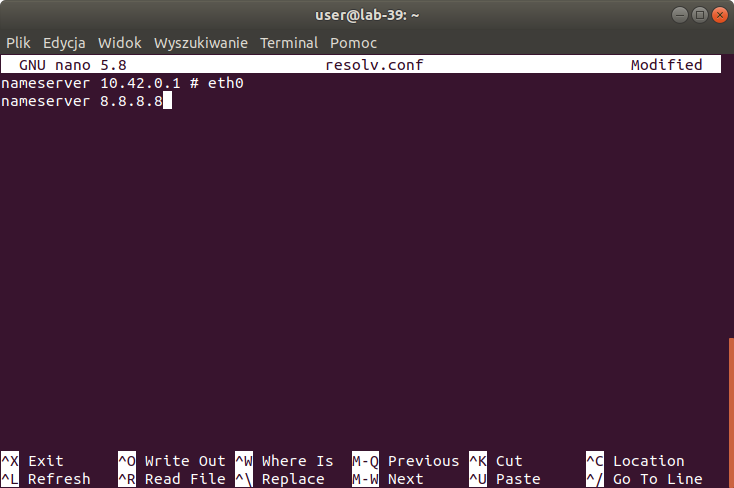
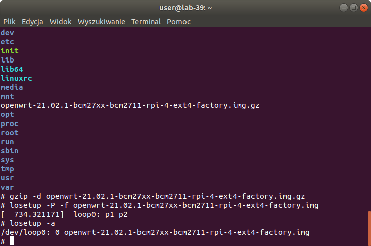
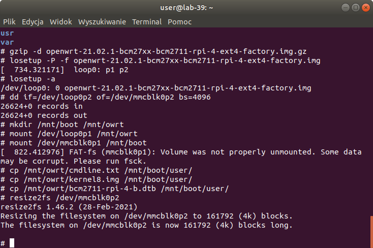
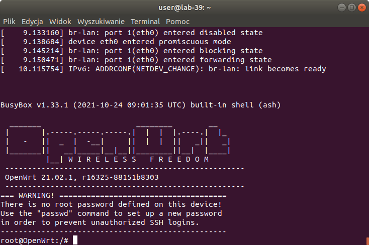
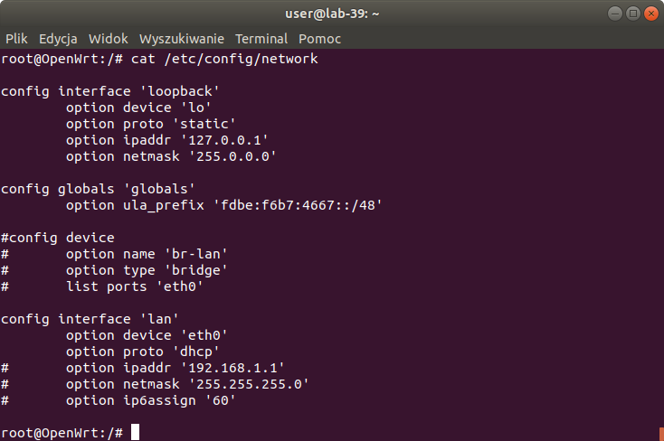
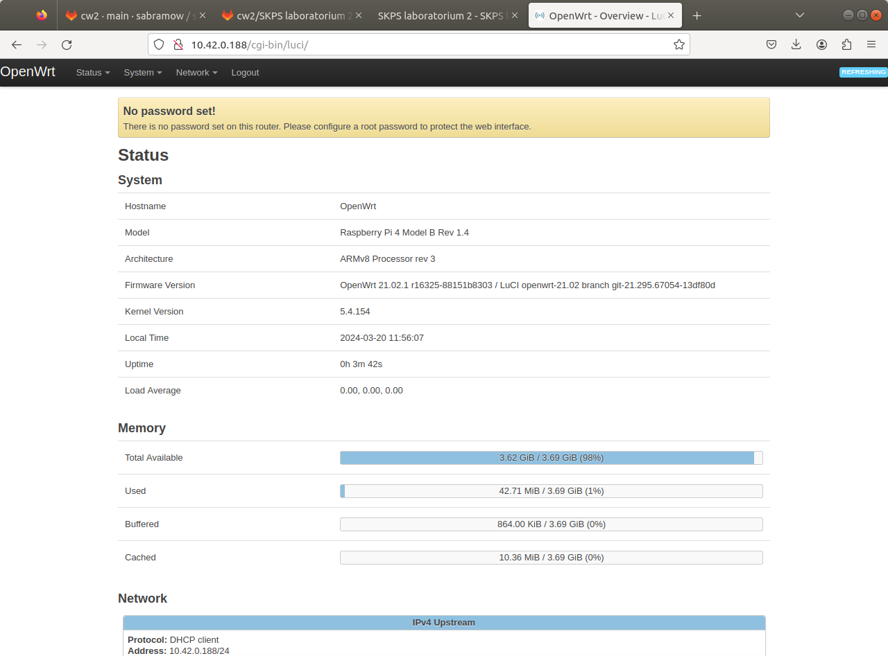

# Raport z laboratorium 2 - 20.03.2024

### Sebastian Abramowski, 325142

### Bogumił Stoma, 325233

---

## Instalacja OpenWRT

Na początku dodaliśmy serwer DNSa na wszelki wypadek do pliku /etc/resolv.conf na systemie ratunkowym



Pobraliśmy obraz systemu przez wget, rozpakowaliśmy go, ustawiliśmy obraz systemu jako urządzenie "loop" i sprawdziliśmy jego nazwę



Następnie zamontowaliśmy partycję pierwszą obrazu OpenWRT oraz pierwszą partycję karty SD w odpowiednie miejsca, następnie przerzuciliśmy wymagane pliki do zbudowania pełnego obrazu systemu na karte SD i powiększyliśmy system plików



Odpaliliśmy system



Następnie zmieniliśmy konfigurację sieci, aby system nie próbował być routerem



Potem, zrestartowalismy ustawienia sieci poleceniem

```
/etc/init.d/network reload
```

Sprawdziliśmy czy jest dostęp do naszego systemu przez HTTP



---

Następnie zainstowaliśmy potrzebne pakiety i zaczęliśmy robić zadania

## Zad. 1 (plik gpio_led_1.py)

```python
import gpio4
from time import sleep

gpio27 = gpio4.SysfsGPIO(27)
gpio27.export = True
gpio27.direction = 'out'

for i in range(10):
    gpio27.value = 1
    sleep(0.5)
    gpio27.value = 0
    sleep(0.5)

gpio27.export = False
```
