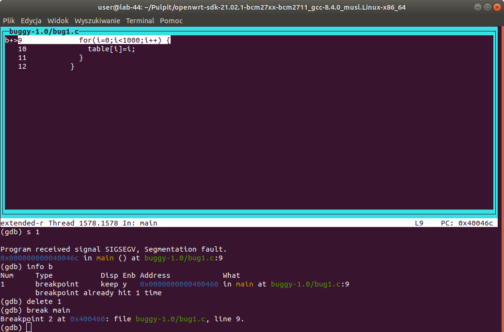
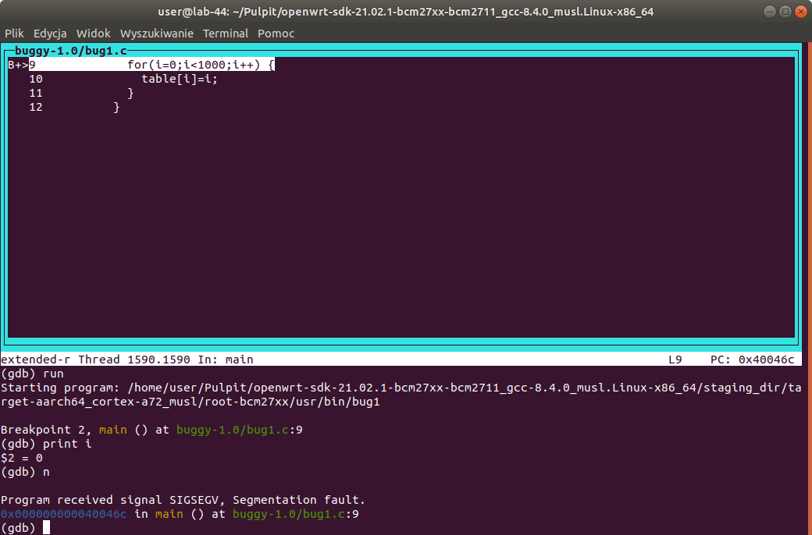
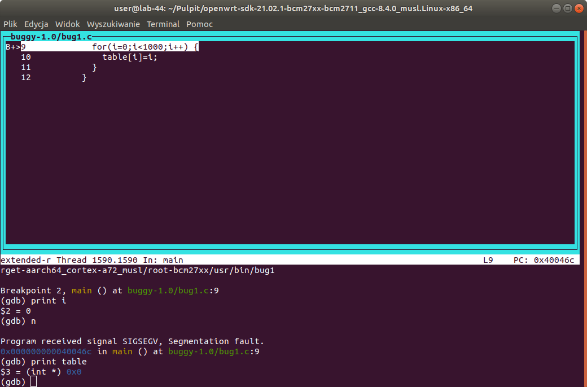
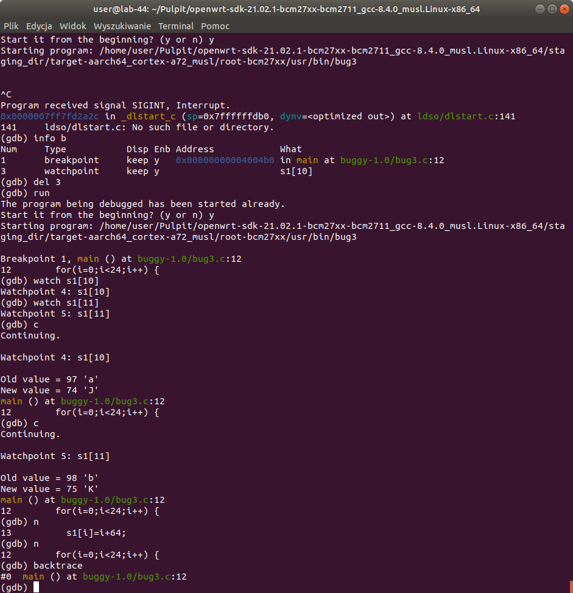

# Raport z laboratorium 3 - 03.04.2024

### Sebastian Abramowski, 325142

### Bogumił Stoma, 325233

---

## Instalacja OpenWRT

Sprawdziliśmy czy system OpenWRT z poprzednich labów się odpala


## Pierwszy pakiet

Pobraliśmy odpowiednią wersję SDK z `https://downloads.openwrt.org/releases/21.02.1/targets/bcm27xx/bcm2711/`

---

Dodaliśmy do pliku feeds.conf.default ścieżkę do katalogu zawierającego katalogi z naszymi pakietami:

```
nano feeds.conf.default
```

Dodaliśmy scieżkę do tego pliku:

```
src-link skps /home/user/Pulpit/openwrt.../demo1_owrt_pkg
```

Zaktualizowaliśmy listy pakietów

```
export LANG=C
./scripts/feeds update -a
./scripts/feeds install -p skps -a
```

Kompilacja paczek

```
make package/feeds/skps/demo1/compile
make package/feeds/skps/demo1mak/compile
```

Skompilowane pakiety:


Skorzystaliśmy z serwera http do przeniesiania plików


Przenieślimy paczke demo1 w postaci pliku .ipk na RPi i ją zainstelowaliśmy i odpaliliśmy


## Pakiety worms i buggy

Pobraliśmy katalogi z worms i buggy i umieściliśmy je w tym samym miejscu co poprzednio demo1 i demo1mak

W katalogach `buggy` i `worms` umieściilśmy pliki Makefile, analogiczne do tych wcześniejszych

Kompilacja paczek

```
export LANG=C
./scripts/feeds update -a
./scripts/feeds install -p skps -a
make package/feeds/skps/worms/compile
make package/feeds/skps/buggy/compile
```

Instalacja pakietów po ich przeniesieniu (zrobliśmy tym samym sposobem co poprzednio)

```
opkg install worms_1.0-1_aarch64_cortex-a72.ipk
opkg install buggy_1.0-1_aarch64_cortex-a72.ipk
```

### Działanie programów:

Odpalenie wormsów:


Odpalenie plików z bugami:


## Debugowanie zdalne

Sprawdziliśmy nasze IP:

```
ip_kompa: 10.42.0.1
ip_RPi: 10.42.0.63
```

Pobraliśmy na RPi potrzebne pakiety

```
opkg update
opkg install gdb
opkg install gdbserver
```

Odpaliliśmy serwer gdb na RPi

```
gdbserver :9000 /usr/bin/bug1
```

Przykładowe odpalenie serwera dla pliku wykonywalnego bug2


Połącznie do serwera gdb z komputera hosta (analogicznie dla innych programów) - 10.42.0.63 to ip RPi

```
./scripts/remote-gdb 10.42.0.63:9000 ./build_dir/target-aarch64_cortex-a72_musl/buggy-1.0/bug2
```

Po połączeniu z komputera hosta ustawiliśmy katalog dla gdb, w którym ma szukać kodu:

```
np. directory /home/user/Puplit/openwrt.../demo1_owrt_pkg/buggy/src
```

### Program bug1

Na czym polegał bug1 - (Segmentation fault) zapis do niezaalokowanej tablicy

Przedstawienie debuggowania:







### Program bug2

Na czym polegał bug2 - (Segmentation fault) wyjście poza zakres tablicy

Przedstawienie debuggowania:


### Program bug3

Na czym polegał bug3 - wyjście poza zakres tablicy, brak Segmentation faulta w tym przypadku (nie wyszliśmy na tyle daleko, że na pewno trafimy na obszar do którego nie mamy uprawnień jak w przypadku programu bug2, później zaczęliśmy zapisywać do tablicy s2, co wydawało nam się dziwne)

Przedstawienie debuggowania:


