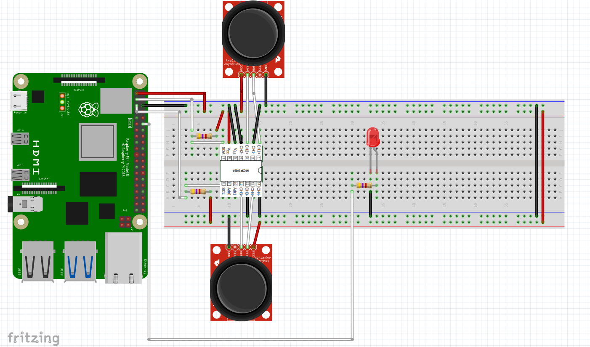
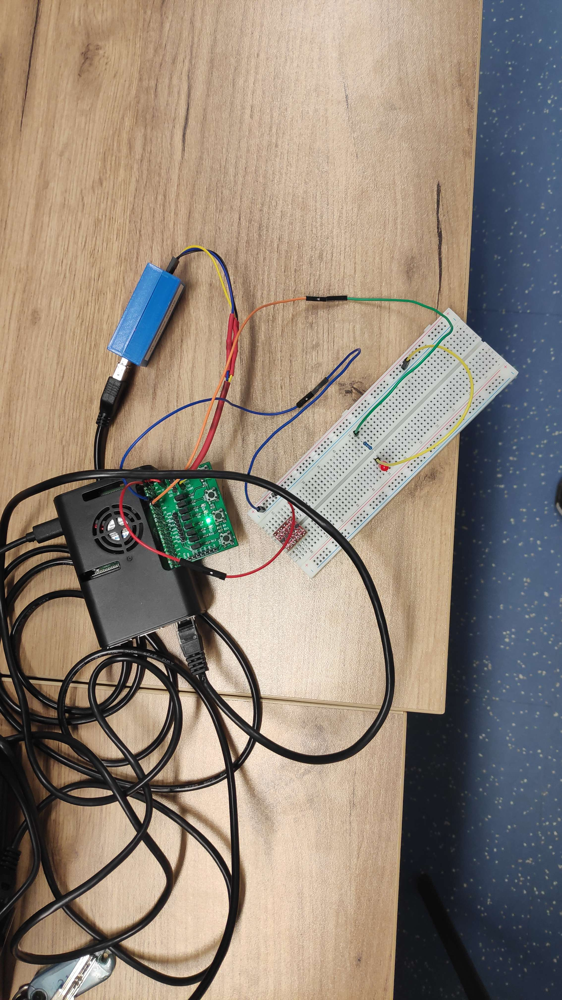
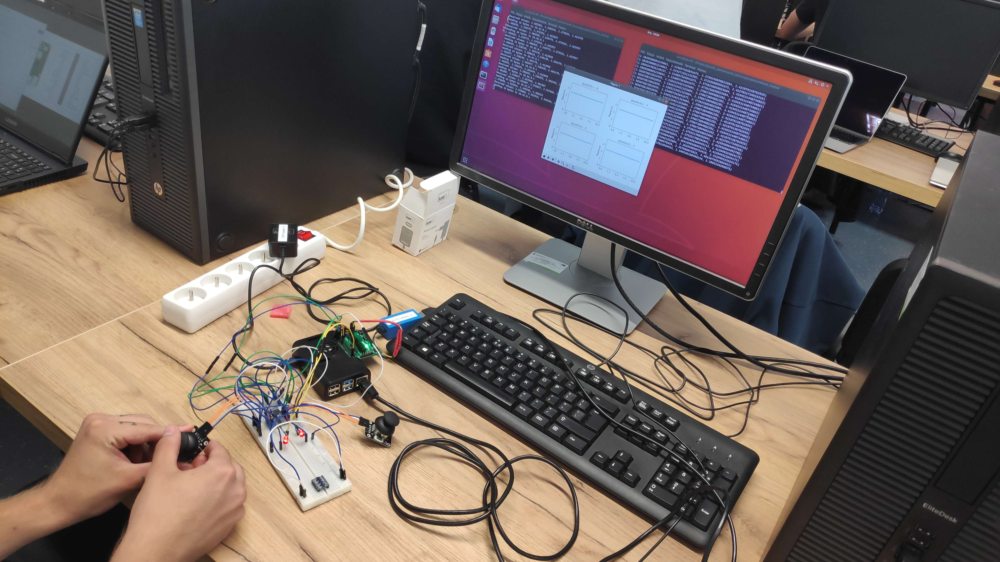
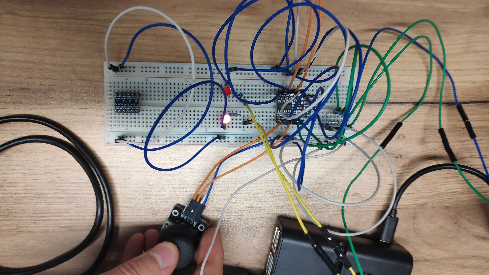
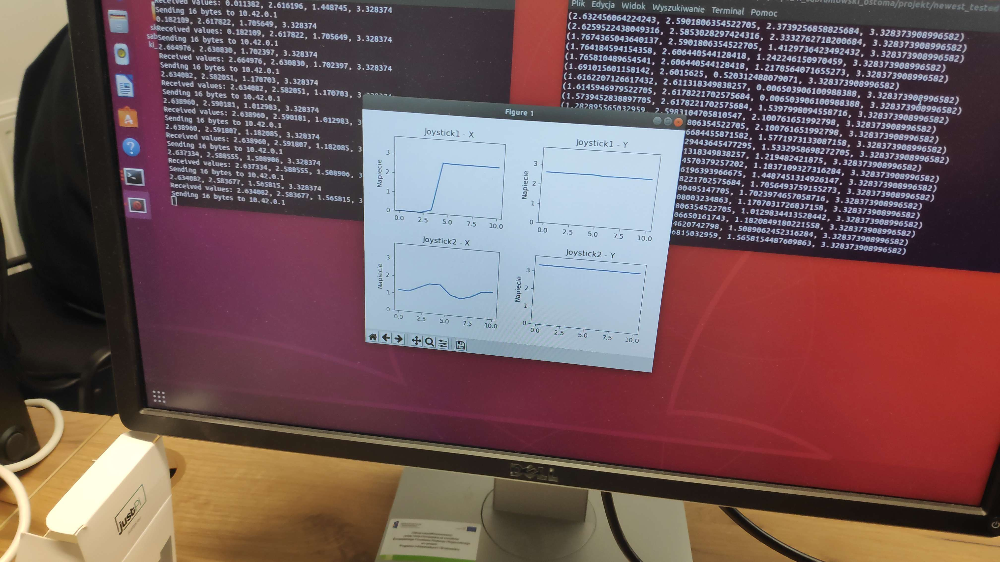

# Raport z laboratorium projektowych - nr. 5, 6 - 29.05.2024, 12.06.2024

### Sebastian Abramowski, 325142

### Bogumił Stoma, 325233

---

## Temat: Zdalny oscyloskop 4-kanałowy, oraz sterowanie efektorem na bazie odczytu z ADC + joystick

## Schemat połączenia

## Informace ogólne

Podłączaliśmy LEDy do GPIO 18, 19 do pinów dla PWM
Zastosowaliśmy nakładki w bootloaderze:

- dtoverlay=i2ci
- dtoverlay=pwm2-chan

## Co udało nam się zrobić na pierwszych labach

- przetestowaliśmy wysyłanie testowych informacji (4 flotów) do innego programu obsługujacego LED oraz wysyłanie informacji przez sieć do klienta na hoście, który robił na podstawie tego wykresy

Schemat podłączenia podczas testów:

- przetestowaliśmy przekazywanie wartości do programu sterującego pojedyczym ledem

Schemat podłączenia podczas testów:

## Co udało nam sie zrobić na drugich labach

Przetestowaliśmy działanie wszystkiego razem

Testowanie:

Przykład działania

Robienie wykresów na podstawie zmian "w czasie rzeczywistym"

## Uruchamienie projektu

- ustawienie wczesniej wspomnianych nakładek w pliku dla bootloadera
- budowa paczki przez specjalne SDK oraz Makefila
- instalacja pakietu
- stworzenie kolejki (czyli piku) przez który wysyłamy dane od programu 'master' do programu 'slave', który steruje ledem przez `mkfifo tmp/singal_to_led_fifo`
- odpalenie w tle programu `slave &`
- odpalenie programu `master`
- na hoście odpalenie pliku client.py z odpowiednim adresem IP, który robi wykresy

## Napotkane błedy

- Mieliśmy lekki problem z dobraniem odpowiednich czasów spania w poszczególnych miejscach, aby wszystko działało w miarę płynnie (wynikało głównie to z tego, że nie mogliśmy na szybko zmieniać wartości programu)
- Napotkaliśmy także problemu z konwerterem UART działającym przy RPi - wyświetlał on dziwne znaczki czasem, podobno przez współdzielenie "ścieżki" jakiegoś pinu z "ścieżką" UARTa
- Na końcu mieliśmy problem z zmierzenime różnicy czasu (od wygenerowania danych przez urządzenie do odebrania przez sieć), wydaje nam się, że to przez to, że próbowaliśmy wysłac timestamp w C przez floata (ponieważ wyniki wysyłaliśmy wszystkie inne w floacie więc było wygodnie), przez to chyba mieliśmy za małą dokładność aby obliczyć prawidłową różnicę czasu

## Co znajduje się w konkretnych plikach

- master.c - program główny, który odczytuje dane z konwertera ADC - MCP3424, wysyła odczytane do kolejki (pliku) /etc/singal_to_led_fifo oraz wysyla pakiety UDP z odcztanymi danymi przez gniazdo przez port 8080
- mcp3424.\* - sterownik do ADC dostosowany  do naszych potrzeb
- server.\* - zajmuje się wysylaniem pakietow oraz poczatkowym polaczeniem z klientem
- slave.\* - program odbierający dane od master.c i sterujący dwoma LEDami na podstawie
- Makefile - do tworzenia pakietu ipk przez SDK, który był przerzucany na RPi
- CMakeLists.txt - użyta do przetestowania czy wszystko się kompiluje przed laboratorium
